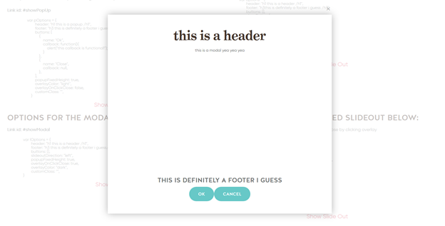
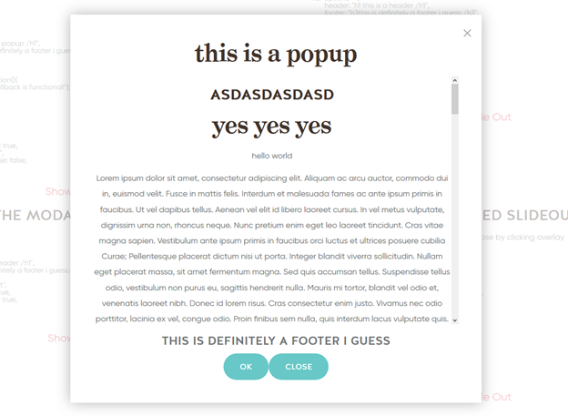
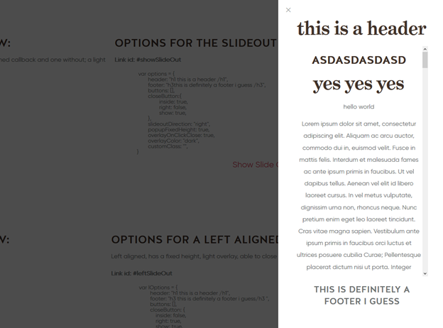

# hModal

Demo: 

http://styleguide.hudsondemo.com/test-page/hmodal

## Getting Started
To create an hmodal, the bare minimum is content. The first argument an hmodal accepts is html in the form of a string.

Example:
```javascript
var bodyHtml = "<h2><strong>Hello World</strong></h2>";
var mybox = new hModal(bodyHtml);
```
Will initialize an hModal.

From here we need to pick a method of rendering, the options are:

Slideout



PopUp



Modal



To render, simply call the type of render function you desire on the hmodal object you previously created.

```javascript
mybox.showPopUp(); //for a Pop Up
mybox.showSlideOut(); //for a Slide Out
mybox.showModal(); //for a Modal
```

## Usage Notes
You should **never** be putting the `new` keyword in any kind of repeatable event, such as click events.
    This will create a copy of the hmodal you want to have every time that you click the event target, resulting in potentially hundreds of hmodals very quickly.

### DO NOT DO THIS
```javascript
$("#myButton").click(function(e){
    var myWrongModal = new hModal(); //THIS BIT SHOULD NOT BE HERE
    
    var myWrongSettings = {
        header: "<h1>This is incredibly incorrect<h1>",
    };
 
    myWrongModal.showPopUp(myWrongSettings);
});
```

### Best Practice
Best practice is to use the window.iModals array. This prevents naming conflicts between hmodals on the website, ensuring that the hmodal your event opens is the hmodal you need it to. 

Syntax:
    To Set: 
        window.iModals[<name of modal>] = new hModal();
    To Use:
        window.iModals[<name of modal>].openModal(); //showModal can be replaced by any other function  

#### Do This 
```javascript
window.iModals['myRightModal'] = new hModal();
$("#myButton").click(function(e)){
    var myRightSettings = {
        header: "<h1>This is incredibly correct<h1>",
    };
 
    window.iModals['myRightModal'].openPopup(myRightSettings);
}
```

If there is no iModals array, you should create the hModal object outside of the event handler, and show it in the event.

```javascript
var myRightModal = new hModal();
$("#myButton").click(function(e)){
    
    
    var myRightSettings = {
        header: "<h1>This is incredibly correct<h1>",
    };
 
    myRightModal.openPopup(myRightSettings);
}
```

## Options
Each render function takes two arguments:
    * HTML(optional)
    ..* Body content for the modal if you wish to override the object’s content.
    * Options(optional)
    ..* A javascript object containing options for the render.

HTML

```html
<div id=”contentArea"></div>
```

JavaScript

```javascript
var lOptions = {
        header: "<h1>this is a header</h1>",
        footer: "<h3>this is definitely a footer i guess</h3>",
        buttons: [],
        closeButton: {
            inside: false,
            right: true,
            show: true,
        },
        slideoutDirection: "left",
        popupFixedHeight: true,
        overlayOnClickClose: true,
        overlayColor: "light",
        customClass: "booking-popup-hmodal",
        contentArea: “#contentArea”
    }
 
mybox.showSlideOut(bodyHtml, lOptions);
```

| Property | Type | Description | Possible Values | Default Value
| --- | --- | --- | --- | --- |
| header | HTML | HTML to be placed in the header section of hmodal | N/A | N/A |
| footer | HTML | HTML to be placed in the footer section of hmodal | N/A| N/A |
| slideoutDirection | String | String describing the side that the slideout will appear. | `"right"` or `"left"` | `"right"` |
| popupFixedHeight | Boolean | Boolean describing whether the popup will have a fixed height (meaning that it will be scrollable). | true or false | `false` |
| overlayOnClickClose | Boolean | Boolean describing whether clicking the overlay will close the popup. | true or false | `true` |
| overlayColor | String | String describing the color of the overlay. | `"light"` or `"dark"` | `dark` |
| customClass | String | String containing the name of a custom css class to be applied to the modal. | Any valid css class | none |
| contentArea | String | A string containing the selector of an html element to grab the body content from. | Any valid selector | none |
| closeButton | Object | An options object describing the location of the close button | [See below](#closeButton) | none |
| Buttons | Array | An array containing objects describing buttons to be placed into the footer of the modal. | [See below](#button-options) | none |


### closeButton
---
The closeButton property takes an object containing true or false settings which describe where the close button for the modal should be placed.

#### Inside
Whether or not it should be inside the hmodal.

Defaults:

| Slideout | Pop Up |
| --- | --- |
| true | true |


#### Right
Whether or not it should be to the right of the modal.

Defaults:

| Slideout | Pop Up |
| --- | --- |
| true | true |

#### Show
Whether or not the close button will be shown.

Defaults:

Defaults:

| Slideout | Pop Up |
| --- | --- |
| true | true |


---

### Button Options
---
The buttons property takes an array of button objects. Each button object is rendered as its own button within the footer of the modal.

```javascript
buttons: [
            {
                name: "Ok",
                callback: function(obj){
                    closeAll(obj);
                },
            },
            {
                name: "Close",
                callback: null,
            },
        ],
```

#### Name
A string containing the text that will appear within the button.

#### Callback
A callback function is a function which will run when the button is clicked. By default, the callback function will close the modal.
* Callback functions are stored in the callback property of the button object.
* Callback functions should be wrapped in an unnamed function to prevent the function from running on page load.
* If you need to access the calling modal in the callback, pass the obj parameter into both the unnamed function and your callback function.

---

## Open and Close Events

* hModal now has 2 custom jQuery events
* `“close”` when close function is called
* `“open”` when open function is called
* Both have an extra parameter which returns the hmodal’s id
* These can be used for advanced functionality in cases where an action needs to be fired every time it closes 

Example of using such event:

```javascript
var coleModal = new hModal();
coleModal.showPopUp();

$(“#”+coleModal.id).on(“close”,function(e, id){
    alert(“hmodal with id ” + id + “ has closed”);
});
```

Note: events bubble, so it is possible to listen for an hmodal close event on the document

Example:

```javascript
$(document).on(“open”, function(e, id){
    alert(“hmodal with id ” + id +” has been opened”);
});
```